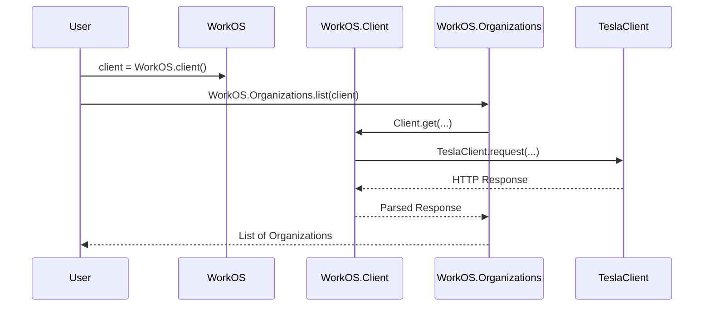

# WorkOS Elixir SDK: Architecture & Contribution Plan

## Overview

This document describes the architecture of the WorkOS Elixir SDK, highlights areas for improvement, and outlines a plan for contributing enhancements. The goal is to help contributors understand the codebase, identify opportunities for improvement, and coordinate efforts to bring the SDK closer to feature and quality parity with officially supported WorkOS SDKs.

---

## 1. High-Level Architecture

- **Purpose:** The SDK provides Elixir applications with convenient access to the WorkOS API, wrapping HTTP endpoints in idiomatic Elixir modules and structs.
- **HTTP Client:** Uses [Tesla](https://github.com/elixir-tesla/tesla) by default, but allows for custom clients via configuration.
- **Configuration:** API key and client ID are set via application config or passed as options to the client struct.
- **Module Organization:** Each WorkOS API domain (e.g., SSO, Directory Sync, Organizations) is encapsulated in its own module under `lib/workos/`.

### High-Level Module Diagram

```mermaid
graph TD
    A[WorkOS (User Entrypoint)] --> B[WorkOS.Client]
    B --> C1[WorkOS.Organizations]
    B --> C2[WorkOS.SSO]
    B --> C3[WorkOS.DirectorySync]
    B --> C4[WorkOS.UserManagement]
    B --> C5[WorkOS.Events]
    B --> C6[WorkOS.AuditLogs]
    B --> C7[WorkOS.Portal]
    B --> C8[WorkOS.Passwordless]
    B --> C9[WorkOS.Webhooks]
    B --> D[Tesla HTTP Client]
```

---

## 2. Request Flow

### Example: Listing Organizations



---

## 3. Entrypoints & Contributor Tasks

### Entrypoints

- **WorkOS:** Main entry for configuration and client creation.
- **WorkOS.Client:** Handles HTTP requests, authentication, and extensibility.
- **API Modules:** Domain-specific modules (e.g., `WorkOS.Organizations`, `WorkOS.SSO`).

### Contributor Tasks & Definitions of Done

| Task | Description | Definition of Done |
|------|-------------|-------------------|
| **Documentation** | Add or improve docs for a module | All public functions have `@doc`, module has `@moduledoc`, at least one usage example |
| **Test Coverage** | Increase tests for a module | All public functions tested, edge/error cases included, >90% coverage |
| **API Endpoint** | Implement missing endpoint | New function(s) in module, with tests, docs, and example usage |
| **Error Handling** | Standardize error returns | All modules use `WorkOS.Error`, error cases tested |
| **Examples** | Add/update example projects | Example compiles, runs, demonstrates real API call, clear setup |

---

## 4. Configuration & Extensibility

- **Configurable via** `config :workos, WorkOS.Client, ...` or by passing options to the client struct.
- **HTTP Client Swapping:** Tesla can be replaced with a custom client by implementing the required behavior.
- **Error Handling:** Centralized in `WorkOS.Errors`.

---

## 5. Areas for Improvement

See [Entrypoints & Contributor Tasks](#3-entrypoints--contributor-tasks) for actionable items.

---

## 6. Contribution Roadmap

Reference the [Entrypoints & Contributor Tasks](#3-entrypoints--contributor-tasks) table for specific, actionable items. Prioritize based on open issues, feature parity, and community feedback.

---

## 7. References

- [WorkOS Elixir SDK GitHub](https://github.com/workos/workos-elixir)
- [WorkOS SDKs Overview](https://workos.com/docs/sdks)
- [HexDocs for Elixir SDK](https://hexdocs.pm/workos/WorkOS.html)
- [elixir-sso-example](https://github.com/workos/elixir-sso-example)

---

## 8. 100% Test Coverage Plan (2024)

**Current Status:**  
- As of the latest build, overall test coverage is **97.0%**.
- Most modules are at 100% coverage, with a few (e.g., `WorkOS.SSO`, `WorkOS.UserManagement`, and some test/support mocks) below 100%.
- Coverage is tracked and reported via [Codecov](https://about.codecov.io/) (see badge/status in the README).

**Plan:**
- Review the coverage report (`mix test --cover` or Codecov dashboard).
- For each module <100%:
  - Add tests for all public functions (happy path, edge, and error cases).
  - Test struct creation, casting, and protocol implementations (e.g., `WorkOS.Castable`).
  - Cover all API surface modules (e.g., `WorkOS.Events`, `WorkOS.DirectorySync`, `WorkOS.SSO`).
  - Test error handling and unusual API responses.
  - Test entrypoint/config modules (`WorkOS`, `WorkOS.Client`, `WorkOS.Error`).
  - Cover helper/empty structs (e.g., `WorkOS.Empty`).
- Address any failing tests and ensure all tests pass.
- Repeat until all modules show 100% in the coverage report and Codecov.
- **Definition of Done:** All modules 100% covered, all tests pass, no regressions.

**Outstanding Work (as of latest run):**
- `lib/workos/sso.ex` (92.3% covered)
- `lib/workos/user_management.ex` (88.0% covered)
- Some test/support mocks (e.g., `test/support/events_client_mock.ex`, `test/support/passwordless_client_mock.ex`)
- 7 test failures to be addressed

---

*This document is a living plan. Please propose updates as the SDK and community evolve.*
